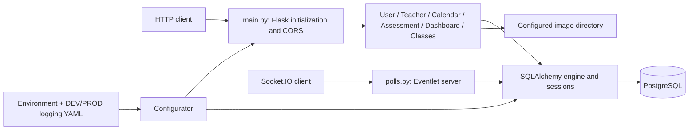

# Virus Hack

A team hackathon backend prototype for an educational-management platform using Flask, PostgreSQL, and a separate Socket.IO polling service.

## Goal

Organize users, teachers, calendars, assessments, classes, and dashboards behind a Python API. The portfolio focus is backend architecture, service organization, and configuration management. Original deployment details and individual feature ownership: **Not documented in the original repository**.

## Requirements

### Software

- Python 3.12 for the HTTP backend; PostgreSQL for database-backed routes.
- Docker is optional. The development image runs the HTTP backend on port 5000.
- Original 2020 dependencies are preserved in [requirements-legacy.txt](requirements-legacy.txt) for historical reference. They are not the supported installation target.

### Build

```sh
python3.12 -m venv .venv
. .venv/bin/activate
python -m pip install -r requirements.txt
cp .env.example .env
```

Edit `.env` with a dedicated local database account and freshly generated password and Flask signing secret. Generate a secret with `python -c 'import secrets; print(secrets.token_hex(32))'`. Quote shell-special characters in `.env`; do not commit it. The application does not automatically load dotenv files.

| Variable | Meaning / default |
|---|---|
| `SERVER_MODE` | `DEV` (default) or `PROD`; selects mode-specific YAML logging |
| `DB_USER`, `DB_PASSWORD`, `DB_NAME` | Required in both modes; no embedded credentials |
| `DB_HOST` | `127.0.0.1` in DEV; required in PROD |
| `DB_PORT` | `5432`; validated range 1–65535 |
| `FLASK_SECRET` | Required, at least 32 characters; JWT signing and Flask `SECRET_KEY` |
| `IMAGES_FOLDER` | Absolute image-directory path; repository `pictures/` in DEV; required in PROD |

The YAML files contain logging settings only. Environment values are validated before API imports or engine creation. Database URL construction preserves special characters in passwords.

### Running

```sh
set -a
. ./.env
set +a
# After a dedicated empty PostgreSQL database and account have been provisioned:
python commands.py create_db
python main.py
# In another terminal:
curl http://127.0.0.1:5000/dashboard/1
```

`create_db` creates SQLAlchemy tables; it does not seed roles or users. No migrations or complete fixture set are provided. The dashboard request is database-free and returns historical demonstration values. The built-in Flask server is intended for local development.

Docker (same edited `.env`; Docker env files use literal values without shell quotes):

```sh
docker build -t virus-hack:dev .
# Set DB_HOST in .env to a PostgreSQL host reachable from the container.
# On Docker Desktop, host.docker.internal addresses a host database.
docker run --rm --env-file .env -p 127.0.0.1:5000:5000 virus-hack:dev
# Initialize a dedicated database, if needed:
docker run --rm --env-file .env virus-hack:dev python commands.py create_db
```

For image routes, mount the image directory and set `IMAGES_FOLDER` to its container path. Database, source images, and real user data are not bundled.

Optional historical polling service:

```sh
python -m pip install -r requirements-polling.txt
python polls.py
```

This starts a separate Socket.IO server on port 5555; use a client compatible with Python Socket.IO 4 / Engine.IO 3. `publishpoll` emits a hard-coded `publish` JSON string. `insertpoll` accepts a JSON string containing `teacher_id`, `student`, `question`, `answers`, and `mark`, then calls the database layer. This service has no implemented client authentication and logs incoming payloads; use synthetic data on an isolated local network.

### Testing

```sh
python -m unittest discover -s tests -p 'test_*.py' -v
python -m pip check
python -m compileall -q main.py private tests
```

The new tests validate configuration, actual application initialization, registered blueprints, a static dashboard response, image-directory overrides, database password encoding, and JWT signing/verification without connecting to PostgreSQL.

The original `python test.py` runs a database-writing seed-style test with fixed IDs and no assertions or teardown. Use only a disposable database. A green smoke suite does not validate database operations or the complete platform. See [docs/validation.md](docs/validation.md) for actual results and limits.

## Implementation

### Architecture



There is no application factory: importing `main.py` validates configuration, imports API modules (which construct the SQLAlchemy engine), creates Flask, enables CORS, and registers six blueprints. Engine construction is lazy with respect to connecting to PostgreSQL. Sessions commit on success, roll back on exceptions, and close in a context manager.

### Main Components

| Blueprint | Source behavior and limitations |
|---|---|
| `/user` | Profile retrieval, registration and login; user-list connection status is randomized and the returned list is duplicated |
| `/teacher` | Teacher information and lesson lookup |
| `/calendar` | Event lookup and student assignment information |
| `/assessment` | Tasks, assignments, image retrieval and annotation pins; upload-image endpoint is a stub, pins-by-ID is static |
| `/dashboard` | Fixed demonstration datasets |
| `/classes` | Incomplete members/create endpoints; duplicate POST `/add` rules shadow the listing implementation |

`private/service/model.py` contains CatBoost wrappers and cross-validation helpers. It is disconnected from the HTTP request flow, references undeclared SHAP in the legacy stack, and has incomplete base methods. No dataset, saved model, demonstrated training run, or measured accuracy is supplied. The unused eager import was removed so HTTP startup does not require the optional research stack.

### Security

DB credentials, JWT/Flask secret, host, and image path come from the environment. Both old PEM files were identical expired public certificates, successfully parsed by OpenSSL; no private-key block was found in those files. They were removed as obsolete material. See [SECURITY_REMEDIATION.md](SECURITY_REMEDIATION.md) for credential rotation, history remediation, and optional disposable TLS generation.

JWT creation/verification and a role-check decorator exist. Historical password storage uses unsalted SHA-256; route access controls are incomplete, CORS is broad, and the error handler can return HTTP 200 for errors. Configuration cleanup does not resolve these application-security limitations. Do not use real student data until these issues are reviewed and fixed.

### Attribution and Contributions

Git history records Andrey Shibaev, Andrey, a.shibaev, and Komissarov Semyon / amerlon-. These are preserved as recorded author names; aliases are not consolidated into ownership claims. The history supports a team project. Individual feature ownership is **Not documented in the original repository**. No license file was present at the reviewed baseline; no new license is asserted.

## Conclusions

The source demonstrates blueprint organization, ORM sessions, authentication plumbing, and a separate polling process. Reproducible configuration and focused smoke checks make these components inspectable. Several routes remain static or incomplete, the DB seed test is not a behavioral regression suite, and the historical ML experiment has no documented evaluation. Database integration and polling behavior need independent validation before any deployment claims.

Dependency compatibility changes and observed checks are recorded in [docs/validation.md](docs/validation.md). No performance or reliability measurements are claimed.

## Topics Studied

- Flask blueprints and REST API organization
- Environment configuration and logging configuration
- PostgreSQL integration and SQLAlchemy session management
- JWT authentication and role-checking code
- Docker packaging and dependency compatibility
- Socket.IO event transport and JSON messages
- Backend service architecture and configuration testing
